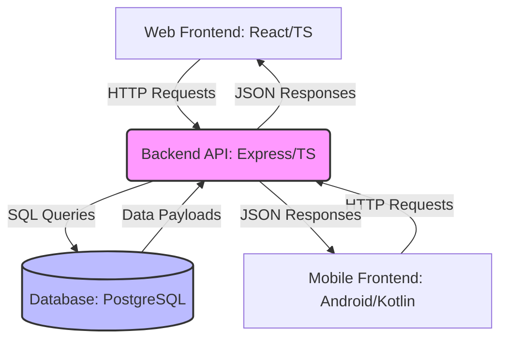

# 💰 Connected Personal Finance Tracker (Master Documentation)

A cross-platform financial tracking system consisting of a React (TypeScript) website and a native Android (Kotlin/Jetpack Compose) application. The ecosystem is driven by a centralized Node.js/Express backend API and a PostgreSQL relational database.

Instead of logging every tiny individual transaction, this application acts as an optimized, stateful "counter" that tracks cumulative subcategory spending totals for a given month.

---

## 🛠️ Unified Tech Stack Blueprint

| Layer | Technology | Language / Specification |
| :--- | :--- | :--- |
| **Backend API** | Express.js (Node.js runtime) | TypeScript |
| **Database** | PostgreSQL | SQL |
| **Web Frontend** | React.js | TypeScript |
| **Mobile App** | Native Android (Jetpack Compose) | Kotlin |

---

## 🏗️ System Architecture & Data Flow

### 1. High-Level Architecture
This diagram outlines how the web dashboard, mobile application, Express API, and cloud PostgreSQL instance communicate.

